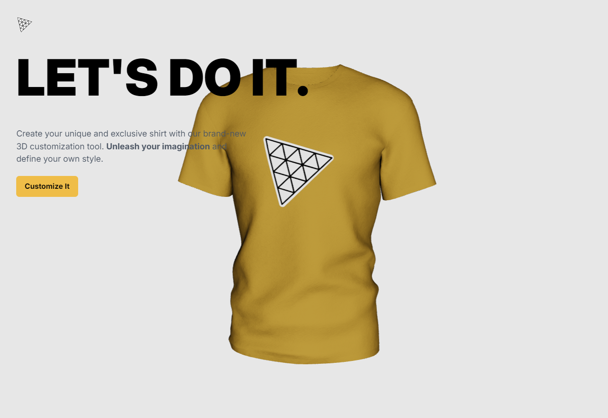

<div align="center">
  <br />
    <a href="#" target="_blank">
      
    </a>
  <br />
 

  <h3 align="center">A 3D Dev Swag Website</h3>
</div>

## 📋 <a name="table">Table of Contents</a>

1. 🤖 [Introduction](#introduction)
2. ⚙️ [Tech Stack](#tech-stack)
3. 🔋 [Features](#features)
4. 🤸 [Quick Start](#quick-start)


## <a name="introduction">🤖 Introduction</a>

Welcome to the 3D Dev Swag Website! This project aims to provide a unique and interactive experience for users to generate and customize 3D shirts and swag items. With the power of React.js, Three.js, and other cutting-edge technologies, users can personalize their swag by applying colors, uploading logos, and even utilizing AI-generated textures. Whether you're a developer looking to showcase your style or a swag enthusiast, this website has something for everyone. Get ready to dive into the world of 3D customization and unleash your creativity!


## <a name="tech-stack">⚙️ Tech Stack</a>

- React.js
- Three.js
- React Three Fiber
- React Three Drei
- Vite
- Tailwind CSS
- Node.js
- Express.js
- Framer Motion
- Valtio

## <a name="features">🔋 Features</a>

👉 **3D Swag Generation**: Generate unique 3D shirts/swag items dynamically

👉 **Color Customization**: Apply any color to the 3D shirt/swag for personalized styling.

👉 **Logo Upload Functionality**: Enable users to upload any file as a logo, integrating it seamlessly onto the 3D shirt.

👉 **Texture Image Upload**: Allow users to upload texture images to style the 3D shirt/swag.

👉 **Download Options**:Dynamically change the application theme based on the selected color, enhancing user experience.

👉 **Theme Change with Color Selection**: Dynamically change the application theme based on the selected color, enhancing user experience

👉 **Responsive 3D Application**: Ensure the application is responsive, delivering a seamless experience across various devices.

👉 **Framer Motion Animation**: Implement framer motion animations for smooth transitions between different 3D models.

and many more, including code architecture and reusability 

## <a name="quick-start">🤸 Quick Start</a>

Follow these steps to set up the project locally on your machine.

**Prerequisites**

Make sure you have the following installed on your machine:

- [Git](https://git-scm.com/)
- [Node.js](https://nodejs.org/en)
- [npm](https://www.npmjs.com/) (Node Package Manager)

**Cloning the Repository**

```bash
git this repository
cd folder
```

**Installation**

Install the project dependencies using npm in both client and server folders:

```bash
npm install
```

**Set Up Environment Variables**

<!-- Create a new file named `.env` in the root of your project and add the following content:

```env
OPENAI_API_KEY=
``` -->

Replace the placeholder values with your actual OpenAI credentials. You can obtain these credentials by signing up on the [Open website](https://openai.com/).

**Running the Project**

1. Server
   ```bash
   npm start
   ```
2. Client
   ```bash
   npm run dev
   ```

Open [http://localhost:5173](http://localhost:5173) in your browser to view the project.
